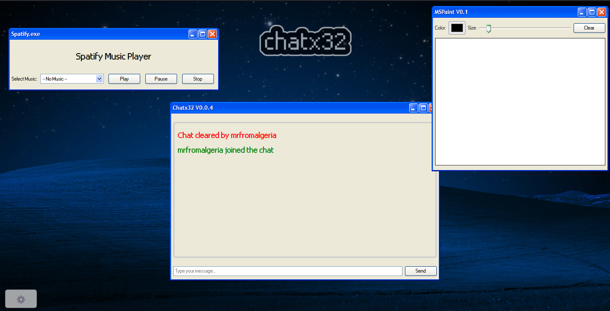

# ChatX32

**Chatx32** is a chat client. Heavily inspired by 2000s chat applications such as MSN. and also is made in a way that makes it feels like Windows XP.
You can call it anything you want. Larpy, sure, because it kind of is larpy

	

This project is now archived. I've been working on it for 3 years now and it was fun. Goodbye ChatX32 and it over 20 users scattered throughout all the years who were also my close friends at the time.

## 📝 Note

> This whole thing is just a joke, and is free to use, copy, distribute or whatever else you want
